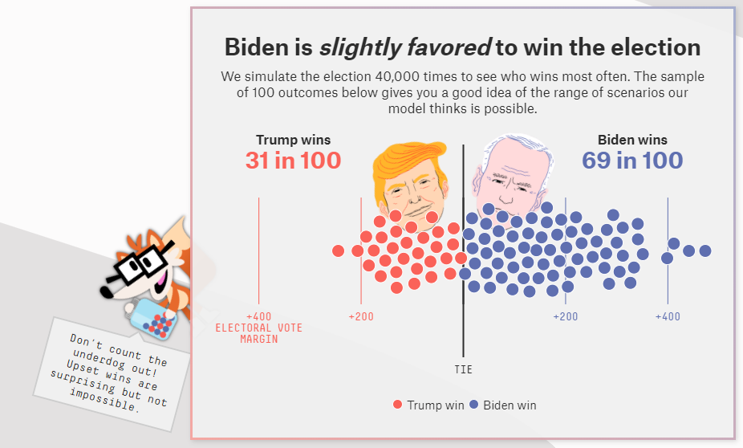
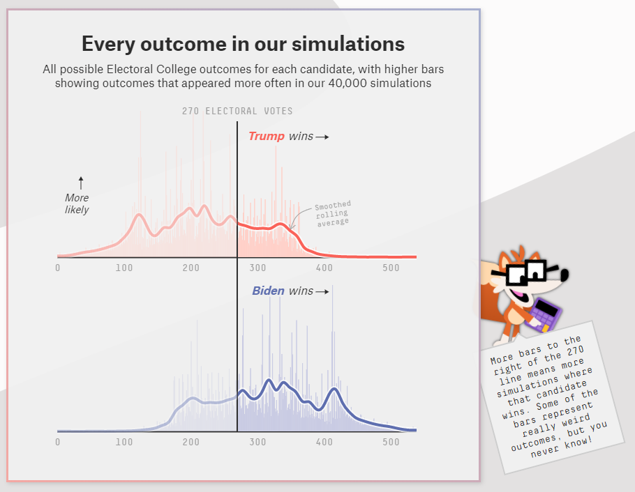
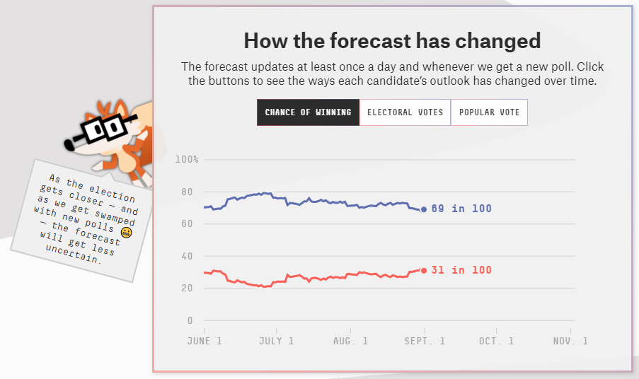
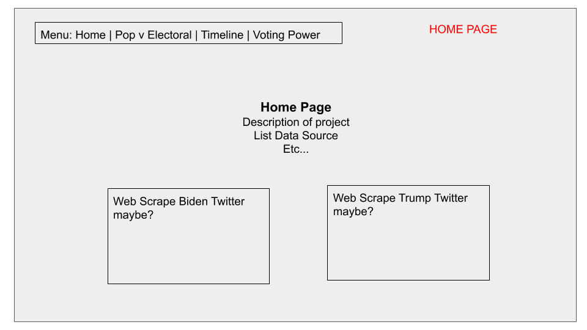
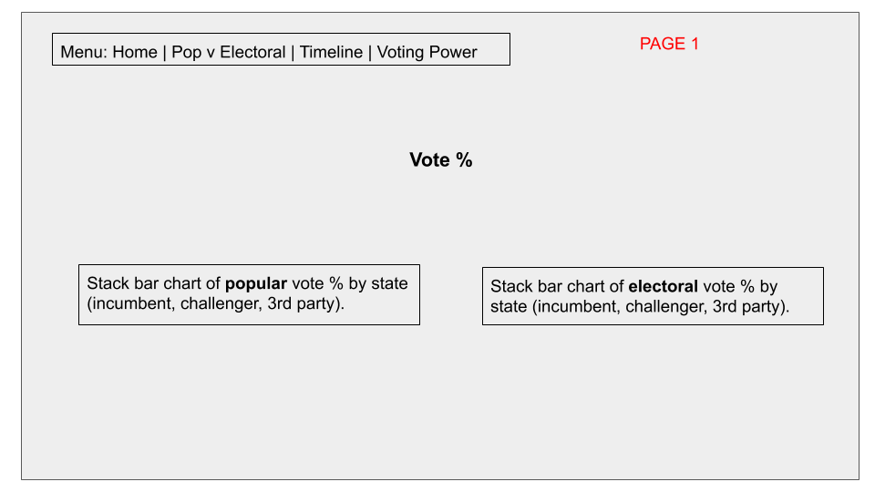
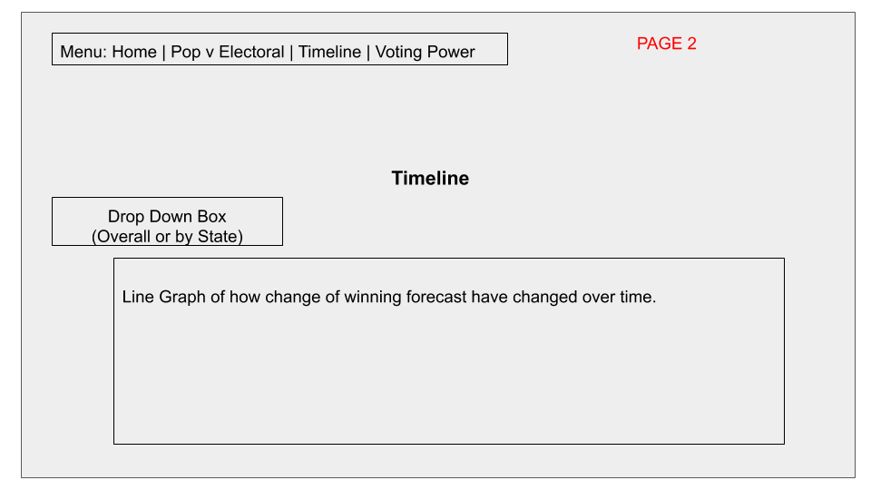
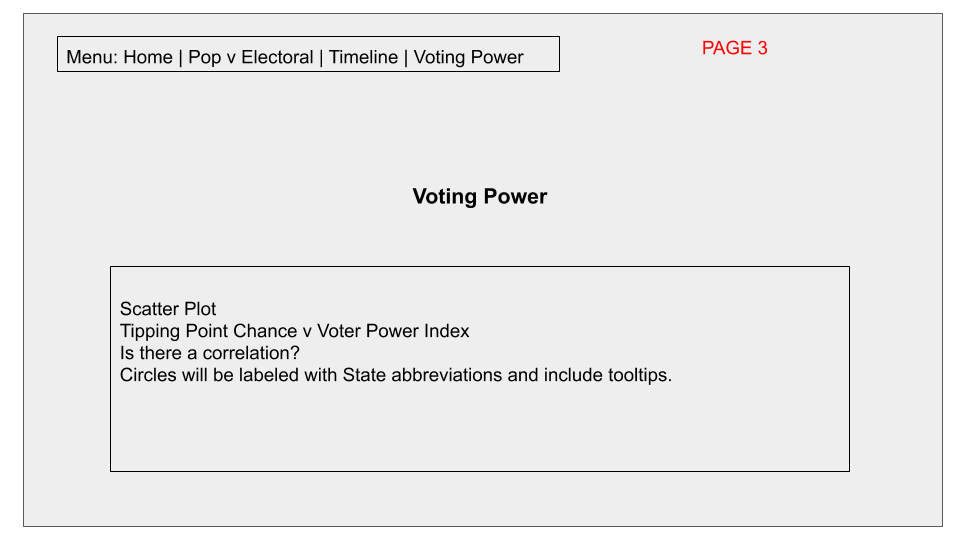

# Project2-2020-US-Presidential-Election

## Team Members:
DeAndrea Norris | Beth Kaster | Maria Martinez

## Description:
For our project, we will be extracting election and polls data. All datasets were discovered from FiveThirtyEight and are being extracted from csv files. 

Our intent is to manipulate data and transform it to ultimately create 3-4 graphics (i.e charts, maps, etc).  In the end, the goal is to visualize the trend in popular vote, electoral votes and overall, who is favored to win.  We want to allow users to customize charts to view more detailed information based on state selection.

## Data Sources:
* https://projects.fivethirtyeight.com/2020-general-data/presidential_national_toplines_2020.csv
* https://projects.fivethirtyeight.com/2020-general-data/presidential_state_toplines_2020.csv
* https://projects.fivethirtyeight.com/2020-general-data/presidential_ev_probabilities_2020.csv
* https://projects.fivethirtyeight.com/2020-general-data/economic_index.csv

## Visualization Inspiration:

## Sketch:

